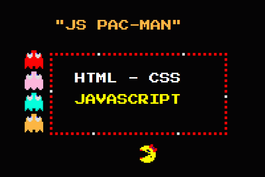

jsPacman
========

jsPacman is a HTML5 / JavaScript DOM based remake of the classic [Ms Pac-Man](https://en.wikipedia.org/wiki/Ms._Pac-Man) game.

Play Demo
-----------
[https://8tentaculos.github.io/jsPacman/](https://8tentaculos.github.io/jsPacman/)

Credits
-----------
* Game algorithm is based on [The Pac-Man Dossier](https://pacman.holenet.info/).
* Sprites are from [spriters-resource](http://www.spriters-resource.com/game_boy_advance/namcomuseum/sheet/22732).

Development
-----------
Install local modules:
```
$ npm install
```
### NPM scripts ###
Run tests:
```
$ npm test
```
Run local dev server at `localhost:8080`
```
$ npm start
```
Build production bundle:
```
$ npm run build
```

Licence
-----------
Source code is under [MIT Licence](http://opensource.org/licenses/mit-license.php).
