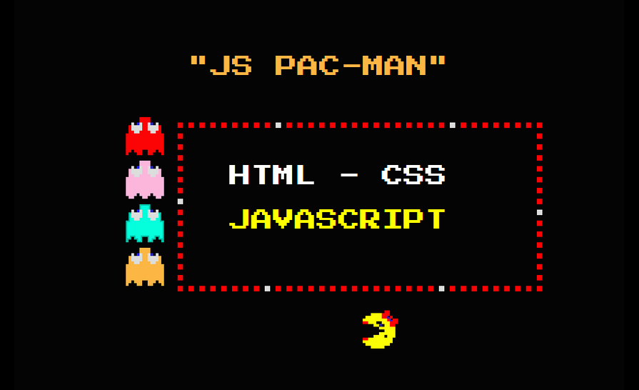

<p align="center">
    
</p>

# jsPacman

A DOM-based remake of [Ms. Pac-Man](https://en.wikipedia.org/wiki/Ms._Pac-Man) built with vanilla JavaScript.  
Uses native ES modules with import maps, no bundler needed.  
Built on [rasti](https://github.com/8tentaculos/rasti) for models, event emitters, and minimal view management.  
Sprites positioned and animated with CSS transforms. Audio handled via Web Audio API.  
Supports keyboard, gamepad (Gamepad API), and touch input. High scores and settings saved to localStorage.

## Play Demo

**[https://pacman.js.org](https://pacman.js.org/)**

## Features

* Classic Ms. Pac-Man gameplay with multiple mazes and levels
* Ghost AI with scatter/chase behavior patterns
* Scaling support for different screen sizes
* Cornering behavior for faster movement
* Power pills and bonus items
* Score system with high score tracking
* Lives system with extra life bonuses
* Multiple input methods: keyboard, gamepad, and touch controls
* Main menu with settings and controls info
* Arcade-style screen FX overlay with scanlines (toggleable)
* Sound effects and music

## Credits

* Game algorithm is based on [The Pac-Man Dossier](https://pacman.holenet.info/).
* Sprites are from [spriters-resource](http://www.spriters-resource.com/game_boy_advance/namcomuseum/sheet/22732).

## History

I started this project in 2013, after about eight years working as a frontend developer on real-time, data-intensive JavaScript applications. At the time, most browser games were still built with Flash, and I wanted to explore what was possible using open web technologies.

To stay focused on game mechanics and 2D game algorithms rather than game design, I chose to remake an existing classic. The first version, released in 2014, used DOM-based rendering instead of canvas (which was not yet widely supported), along with jQuery, a simple game plugin, AMD modules, and Grunt.

Over time, the project went through several refactors while keeping the DOM rendering approach. Dependencies were removed, a small custom game engine was introduced and modern Web APIs were adopted. The current version uses native ES modules in the browser with import maps, removes bundlers entirely, and adds features like scaling, touch, and gamepad support.

**jsPacman** is both a playable game and a long-running experiment in browser-based game development.

## Development

Install dependencies:
```
$ npm install
```

### NPM scripts ###

Run tests:
```
$ npm test
```

Start development server at `localhost:3000`:
```
$ npm start
```

Preview production build at `localhost:3000`:
```
$ npm run preview
```

Build production bundle:
```
$ npm run build
```

The project uses native ES modules with import maps, so no bundler is required during development. The build script only minifies and copies files to the `dist` directory.

## License

Source code is open-source and available under the [MIT License](LICENSE).

## Contributing

Contributions are welcome! Share feature ideas or report bugs on our [GitHub Issues page](https://github.com/8tentaculos/jsPacman/issues).
